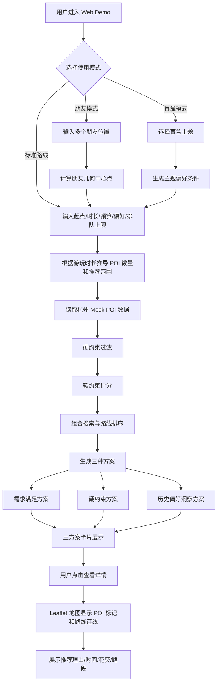

# AI 本地路线智能规划系统 PRD v2.1：最终交付版

## 0. 文档信息

### 0.1 文档状态

| 字段 | 内容 |
|---|---|
| 项目名称 | AI 本地路线智能规划系统 |
| 当前版本 | v2.1 最终交付规划版 |
| 当前阶段 | 需求重构完成 / 进入开发执行阶段 |
| 目标提交时间 | 2026-06-07 |
| 当前目标 | 在 6 月 7 日前完成可在线访问、可点击体验、界面适合演示的 Web Demo |
| 开发策略 | 先完成 P0 MVP，再在 6 月 7 日前迭代完成 P1 创新增强与 P2 展示优化 |
| 数据策略 | MVP 使用杭州 Mock POI、Mock 用户画像与模拟 UGC 评论；后续预留真实 API 接入 |
| 技术建议 | Flask + 原生 HTML/CSS/JavaScript + Leaflet |
| 协作方式 | 双人共同参与代码开发，使用 GitHub 分支协作与 Vibe Coding 推进 |

### 0.2 更新记录

| 版本号 | 版本状态 | 更新日期 | 核心更新内容 |
|---|---|---|---|
| v1.0 | 需求初稿 | 2026-05-23 | 初步阐述项目背景、目标、核心功能与创新设想 |
| v1.1 | 需求评审 | 2026-05-24 | 补充三方案定义、约束清单、LLM 角色、UI 方案与朋友选址、盲盒路线等功能 |
| v2.0 | 可执行版 | 2026-05-25 | 重构 PRD 结构，统一三方案命名，明确 P0/P1/P2 优先级与 Mock 数据边界 |
| v2.1 | 规划版 | 2026-05-25 | 修正交付节奏：6 月 7 日为最终提交日，P1/P2 不属于赛后扩展，而是 6 月 7 日前的迭代增强与展示优化内容 |

### 0.3 名词解释

| 术语 | 解释 |
|---|---|
| POI | Point of Interest，兴趣点，指地图上的具体地点，如餐厅、咖啡馆、景点、书店等 |
| UGC | User Generated Content，用户生产内容，本项目中主要指用户评论、点评文本与体验标签 |
| 路线引擎 | 负责 POI 过滤、评分、组合搜索、路线排序与路线输出的核心模块 |
| 三方案 | 系统同时生成的三类路线方案：需求满足方案、硬约束方案、历史偏好洞察方案 |
| 需求满足方案 | 优先满足用户当前输入目标的路线，允许轻微超预算或排队更久，以换取更符合偏好的体验 |
| 硬约束方案 | 严格满足预算、时间、排队、营业时间、距离范围等约束的路线 |
| 历史偏好洞察方案 | 基于 Mock 用户画像、偏好标签与模拟 UGC 评论生成的个性化路线 |
| 盲盒路线 | 用户选择主题后，系统生成具有惊喜感和探索感的路线 |
| 朋友中心选址 | 多人出游时，系统根据多个朋友起点计算相对公平的集合点 |
| MVP | Minimum Viable Product，最小可运行版本，本项目中指先跑通“输入—路线生成—三方案—地图—解释”的核心闭环 |

### 0.4 本版 PRD 的使用说明

本 PRD 是项目开发过程中的单一事实来源，后续 AI 编码、功能拆解、GitHub 协作、README 编写和演示视频制作均以本版本为准。

本版本需要特别明确：项目开发应采用“先完成 MVP，再持续迭代增强”的节奏。P0、P1、P2 均属于 6 月 7 日前的交付范围，只是开发顺序和优先级不同。

---

## 一、需求背景与目标

### 1.1 赛题背景

赛题为“现在就出发：AI 本地路线智能规划”。赛题关注用户在本地出行、游玩、聚餐或短途探索中，需要将多个目的地串联成高效路线，同时还要面对预算、排队时间、营业时间、口味偏好、多人协调等多重决策负担。

现有搜索和地图工具通常只能解决单点搜索或地理路径问题，用户仍然需要在多个平台之间反复筛选、比较和组合。赛题要求设计并实现一个本地智能路线规划系统，让用户输入出行目标后，系统能够结合 POI 数据、UGC 智慧和用户偏好，自动生成可执行的个性化路线方案。

### 1.2 项目定位

本项目定位为一个面向本地生活场景的 AI 路线规划 Web Demo。它不是单纯的地图导航工具，而是一个帮助用户降低本地生活决策成本的智能规划工具。

项目的核心定位为：

> 基于杭州 Mock POI 数据、模拟 UGC 评论和 Mock 用户画像，自动生成可执行、可比较、可解释的本地生活路线方案，并通过 Web 页面和 Leaflet 地图进行可视化展示。

本项目既要满足赛题中“路线生成”和“多条件与个性化”的基础要求，也要通过三方案并行、朋友中心选址、盲盒路线、UGC 评论模拟和用户画像偏好等功能体现创新性。

### 1.3 目标用户

| 用户类型 | 典型特征 | 核心需求 |
|---|---|---|
| 都市白领 | 周末或下班后想短时间放松，不想花太多时间筛选地点 | 快速获得低决策成本、少排队、适合放松的路线 |
| 朋友聚餐组织者 | 多人从不同地点出发，难以协调集合点和活动安排 | 计算相对公平的集合点，并生成后续聚餐/游玩路线 |
| 周末 citywalk 用户 | 想探索城市，但不确定去哪里 | 获得主题化、小众、有惊喜感的路线 |
| 外地游客 | 时间有限，希望高效体验城市特色 | 快速生成可执行的半日或一日路线 |
| 选择困难型用户 | 面对大量商家和景点信息（例如杭州）难以选择 | 通过三方案对比快速做决策 |

### 1.4 核心用户场景

用户周末在杭州想和朋友一起出门，输入“想吃川菜，预算 200 元，不想排队太久，玩 4 小时”。系统根据起点、游玩时长、预算、偏好和最大排队时间，从杭州 Mock POI 数据中筛选候选地点，生成三种路线方案：

1. 需求满足方案：更优先满足“想吃川菜”和体验感，允许轻微超预算或稍长排队；
2. 硬约束方案：严格控制预算、排队时间、营业时间和距离范围；
3. 历史偏好洞察方案：结合 Mock 用户画像和模拟评论，推荐更符合用户长期偏好的路线。

用户可以在 Web 页面上查看三张方案卡片，点击后展开路线详情，并在 Leaflet 地图上看到 POI 标记和路线连线。

### 1.5 核心痛点

| 痛点 | 说明 | 本项目对应解决方式 |
|---|---|---|
| 决策成本高 | 用户需要在地图、点评、社交平台之间反复筛选地点 | 一次输入后自动生成路线方案 |
| 路线规划只看距离 | 传统地图更关注最短路径，忽略排队、预算、体验等本地生活因素 | 引入预算、排队、营业时间、UGC 评论和用户偏好等因素 |
| 多人出行难协调 | 多人起点分散，集合地点难以确定 | 朋友中心选址功能自动计算集合点 |
| 推荐结果不透明 | 用户不知道为什么系统推荐某条路线 | 每条路线给出推荐解释 |
| 热门店不一定适合 | 高评分、高热度地点可能排队久、体验不稳定 | 结合排队时间和 UGC 评论标签进行过滤与评分 |
| 探索需求难满足 | 用户想发现新地点，但不知道如何筛选 | 盲盒路线提供主题化探索体验 |

### 1.6 项目目标

#### 1.6.1 最终交付目标

在 2026 年 6 月 7 日前完成以下交付：

1. 一个可在线访问的 Web Demo；
2. 用户可以实际点击体验完整路线生成流程；
3. 页面具备较好的展示效果，适合比赛评审演示；
4. GitHub 仓库包含完整代码、README、运行说明、项目截图与后续扩展说明；
5. 准备 1–2 分钟演示脚本和演示视频；
6. 保留真实 POI、真实 UGC、真实 LLM 和真实用户偏好数据的后续接入说明。

#### 1.6.2 阶段性目标

| 阶段 | 目标 | 说明 |
|---|---|---|
| P0 MVP 阶段 | 跑通核心闭环 | 完成输入、路线生成、三方案展示、地图展示和基础解释 |
| P1 创新增强阶段 | 补齐比赛亮点功能 | 完成朋友中心选址、盲盒路线、UGC 评论模拟、用户画像增强等 |
| P2 展示优化阶段 | 提升最终作品完成度 | 优化 UI、交互、README、视频、部署和答辩材料 |

### 1.7 用户故事

| 编号 | 用户故事 | 优先级 |
|---|---|---|
| US-01 | 作为一名周末出游用户，我想输入出行偏好后自动获得路线，以便减少反复搜索和筛选的时间 | P0 |
| US-02 | 作为一名预算有限的用户，我想让路线控制总花费，以便避免超预算 | P0 |
| US-03 | 作为一名不想排队的用户，我想让系统避开排队时间过长的地点，以便提高出行体验 | P0 |
| US-04 | 作为一名选择困难用户，我想同时看到三种方案，以便快速比较并选择路线 | P0 |
| US-05 | 作为一名朋友聚会组织者，我想根据朋友所在地点自动计算集合点，以便减少沟通成本 | P1 |
| US-06 | 作为一名探索型用户，我想选择盲盒路线，以便发现小众但有趣的地点 | P1 |
| US-07 | 作为一名个性化推荐用户，我想让系统结合我的历史偏好推荐路线，以便获得更懂我的方案 | P1 |
| US-08 | 作为一名评委或体验者，我想通过在线 Demo 快速理解项目亮点，以便判断项目完成度 | P2 |

### 1.8 需求范围

#### 1.8.1 In-Scope：6 月 7 日前需要完成

| 范围 | 内容 |
|---|---|
| 核心路线生成 | 基于杭州 Mock POI 数据，完成 POI 过滤、评分、组合搜索与路线输出 |
| 三方案展示 | 需求满足方案、硬约束方案、历史偏好洞察方案并排展示 |
| 地图可视化 | 使用 Leaflet 显示 POI 标记、路线连线和基本地图交互 |
| 推荐解释 | MVP 阶段使用固定模板 + Mock 用户画像生成推荐解释 |
| 用户画像 | 使用本地 `user_profile.json` 模拟用户历史偏好 |
| UGC 智慧 | 使用模拟评论文本和 UGC 标签参与解释和评分 |
| 朋友中心选址 | 支持输入或选择多个朋友位置，计算集合点并生成后续路线 |
| 盲盒路线 | 支持选择主题并生成探索型路线 |
| 页面优化 | 完成适合演示的 Web 页面、三方案卡片、详情展示和基础美化 |
| 项目交付 | GitHub README、部署链接、演示视频、演示脚本与后续扩展说明 |

#### 1.8.2 Out-of-Scope：本次不实现，但保留扩展说明

| 不做内容 | 原因 | 后续扩展方式 |
|---|---|---|
| 真实美团/大众点评 API 接入 | 黑客松周期内接口获取与稳定性不可控 | 预留数据接口，后续替换 Mock 数据源 |
| 用户登录系统 | 与核心路线规划无直接关系，开发成本较高 | 后续接入账号系统后记录历史行为 |
| 真实历史行为推荐模型 | 需要真实用户行为数据 | 后续用用户点击、收藏、浏览、下单等行为训练偏好模型 |
| 真实公交/驾车/实时路况 | 接入地图路径 API 成本较高 | 后续接入高德/百度/美团地图能力 |
| 复杂 AB 测试与商业转化分析 | 当前重点是可演示 Demo | 后续基于埋点进行推荐效果评估 |
| 多城市正式上线 | 当前城市固定为杭州 | 后续扩展到北京、上海、成都等城市 |

### 1.9 功能优先级

本项目的 P0、P1、P2 都属于 6 月 7 日前的交付范围，只是开发顺序不同。

#### P0：MVP 必须完成内容

P0 的目标是在中途快速形成可运行、可点击、可部署的最小闭环。

| 需求 ID | 模块 | 需求描述 | 验收标准 |
|---|---|---|---|
| R001 | 数据层 | 构建杭州 Mock POI 数据 | 至少包含 40–60 个 POI，字段完整 |
| R002 | 用户输入 | 支持输入起点、游玩时长、预算、偏好、最大排队时间 | 表单可提交，字段可传入后端 |
| R003 | 路线生成 | 根据用户输入生成路线 | 返回 POI 顺序、时间、花费、路段信息 |
| R004 | 三方案 | 生成需求满足、硬约束、历史偏好洞察三种方案 | 三张方案卡片结果有差异 |
| R005 | 地图展示 | 使用 Leaflet 显示路线 | 地图显示 POI 标记和路线连线 |
| R006 | 路线详情 | 展示 POI 列表、到达时间、停留时间、预计花费 | 点击卡片可查看详情 |
| R007 | 推荐解释 | 使用模板生成基础解释 | 每条方案都有简短推荐理由 |
| R008 | 在线部署 | Web Demo 可在线访问 | 评委可打开链接体验 |

#### P1：创新功能增强内容

P1 的目标是在 MVP 基础上补齐比赛亮点功能。

| 需求 ID | 模块 | 需求描述 | 验收标准 |
|---|---|---|---|
| R101 | 朋友中心选址 | 支持多个朋友地点输入，计算集合点 | 可点击进入朋友模式并生成路线 |
| R102 | 杭州地标选择器 | 提供杭州常用地标作为起点/朋友位置 | 可从下拉列表选择地标 |
| R103 | 盲盒路线 | 支持 citywalk、吃吃喝喝、文化之旅等主题 | 可点击生成主题路线 |
| R104 | UGC 评论模拟 | POI 包含模拟评论文本 | 推荐理由可引用评论特征或标签 |
| R105 | 用户画像增强 | 使用 `user_profile.json` 参与历史偏好方案 | 历史偏好方案与用户画像有关 |
| R106 | 游玩时长推导 | 根据时长自动决定 POI 数量和推荐范围 | 2 小时与 6 小时返回路线长度不同 |
| R107 | 三方案差异化 | 三方案使用不同权重生成路线 | 三方案在 POI、总价、等待时间或解释上存在明显差异 |
| R108 | 异常提示 | 条件过严时给出可理解提示 | 不显示空白或系统报错 |

#### P2：最终展示与交付优化内容

P2 的目标是在最终提交前提升完成度和展示效果。

| 需求 ID | 模块 | 需求描述 | 验收标准 |
|---|---|---|---|
| R201 | UI 美化 | 优化首页、卡片、地图、详情区视觉 | 页面适合比赛展示 |
| R202 | 交互优化 | 增加 loading、错误提示、按钮状态、防重复提交 | 用户操作过程更顺畅 |
| R203 | README | 完成项目介绍、功能说明、运行方式、截图、架构说明 | GitHub 首页清晰可读 |
| R204 | 部署说明 | 记录在线部署方式和本地启动方式 | 评委和开发者可复现运行 |
| R205 | 演示视频 | 录制 1–2 分钟功能演示 | 视频能展示核心功能和亮点 |
| R206 | 演示脚本 | 准备简短讲解稿 | 能清楚说明问题、方案、创新和结果 |
| R207 | API 扩展说明 | 说明后续如何接入真实 POI、UGC、LLM、用户历史数据 | 体现项目可扩展性 |
| R208 | 最终测试 | 完成端到端点击测试和 bug 修复 | 提交前主流程无明显错误 |

---

## 二、方案概述

### 2.1 产品主线

本项目的核心主线为：

> 用户输入出行需求 → 系统解析输入 → 根据游玩时长推导范围和 POI 数量 → 筛选杭州 Mock POI → 生成三种路线方案 → 地图展示路线 → 输出推荐解释 → 用户选择路线。

朋友中心选址和盲盒路线属于主线的扩展入口，但最终仍然进入路线生成与地图展示流程。

### 2.2 核心业务流程图



### 2.3 三方案生成逻辑

本项目统一使用以下三种方案，不再使用“省钱/品质/平衡”的表述。

| 方案 | 目标 | MVP 实现方式 | 后续增强方向 |
|---|---|---|---|
| 需求满足方案 | 优先满足用户当前输入目标 | 偏好匹配权重更高，允许轻微超预算或更长等待 | 引入更复杂的体验价值评分 |
| 硬约束方案 | 严格满足预算、时间、排队、营业时间和距离约束 | 对预算、等待时间、营业时间等做强过滤 | 引入约束求解和路径优化算法 |
| 历史偏好洞察方案 | 结合用户长期偏好生成更懂用户的路线 | 使用 Mock 用户画像和 UGC 标签参与评分 | 接入真实 LLM 做意图识别和偏好推断 |

### 2.4 信息架构

```text
AI 本地路线智能规划 Web Demo
├── 首页输入区
│   ├── 模式选择
│   │   ├── 标准路线
│   │   ├── 朋友中心选址
│   │   └── 盲盒路线
│   ├── 起点选择
│   │   ├── 杭州地标选择
│   │   └── 手动输入坐标
│   ├── 出行偏好
│   │   ├── 游玩时长
│   │   ├── 预算
│   │   ├── 最大排队时间
│   │   ├── 口味/主题偏好
│   │   └── 出行对象
│   └── 生成路线按钮
├── 结果展示区
│   ├── 三方案卡片
│   │   ├── 需求满足方案
│   │   ├── 硬约束方案
│   │   └── 历史偏好洞察方案
│   ├── 方案核心指标
│   │   ├── POI 数量
│   │   ├── 总耗时
│   │   ├── 总花费
│   │   └── 总等待时间
│   └── 推荐解释
├── 地图展示区
│   ├── Leaflet 地图
│   ├── POI 标记
│   ├── 路线连线
│   └── 当前选中方案高亮
└── 详情展开区
    ├── POI 顺序列表
    ├── 到达/离开时间
    ├── 停留时长
    ├── 交通段距离和时间
    ├── 模拟 UGC 评论
    └── 完整推荐理由
```

### 2.5 页面状态

| 状态 | 页面表现 |
|---|---|
| 初始状态 | 显示输入表单、模式选择、杭州默认起点、生成按钮 |
| 加载状态 | 点击生成后显示 loading 文案，如“正在为你规划路线...” |
| 成功状态 | 显示三方案卡片、地图路线和推荐解释 |
| 失败状态 | 显示错误提示，如“当前条件下无可用路线，请放宽预算或排队时间” |
| 空状态 | 尚未生成路线时地图显示杭州默认中心区域和提示文案 |
| 切换状态 | 用户点击不同方案卡片时，地图和详情内容同步切换 |

---

## 三、细节方案

### 3.1 数据方案

#### 3.1.1 城市与数据量

MVP 城市固定为杭州。POI 数据建议准备 40–60 个，优先覆盖西湖、湖滨、武林、城西、滨江、运河、钱江新城等适合演示的区域。

建议数据分布：

| POI 类型 | 建议数量 | 示例 |
|---|---:|---|
| 餐厅 | 15–20 | 川菜、杭帮菜、日料、火锅、小吃 |
| 咖啡/饮品 | 8–10 | 咖啡馆、奶茶、甜品 |
| 景点/公园 | 8–10 | 西湖、运河、西溪、钱塘江沿线 |
| 文化空间 | 5–8 | 书店、展览馆、博物馆 |
| 购物/商圈 | 5–8 | 湖滨银泰、武林商圈、滨江商圈 |

#### 3.1.2 POI 数据字段

```json
{
  "id": "poi_001",
  "name": "西湖边川味小馆",
  "type": "restaurant",
  "category": "川菜",
  "lng": 120.1551,
  "lat": 30.2741,
  "area": "西湖/湖滨",
  "rating": 4.7,
  "avg_price": 88,
  "wait_time": 15,
  "open_time": "10:00",
  "close_time": "22:00",
  "stay_duration": 90,
  "popularity": 82,
  "tags": ["川菜", "适合朋友聚会", "排队快", "口味重"],
  "ugc_comments": [
    "翻台比较快，周末也不用等太久。",
    "适合朋友聚餐，环境比较热闹。"
  ],
  "suitable_for": ["朋友", "情侣"],
  "is_hidden_gem": false
}
```

#### 3.1.3 用户画像字段

```json
{
  "user_id": "mock_user_001",
  "favorite_categories": ["川菜", "咖啡", "citywalk"],
  "price_preference": "80-150",
  "wait_tolerance": 20,
  "preferred_tags": ["排队快", "适合朋友聚会", "小众", "安静"],
  "disliked_tags": ["排队久", "过度网红", "价格高"],
  "visited_pois": ["poi_003", "poi_011"],
  "recent_behavior": ["收藏咖啡馆", "浏览西湖 citywalk", "搜索川菜"]
}
```

#### 3.1.4 杭州地标数据

朋友中心选址和起点选择需要杭州地标数据。

| 地标 | 经度 | 纬度 | 说明 |
|---|---:|---:|---|
| 西湖断桥 | 120.1499 | 30.2617 | 西湖经典起点 |
| 湖滨银泰 | 120.1646 | 30.2552 | 商圈聚集地 |
| 武林广场 | 120.1630 | 30.2768 | 市中心地标 |
| 杭州东站 | 120.2120 | 30.2917 | 外地游客常用起点 |
| 西溪湿地 | 120.0648 | 30.2702 | 自然休闲场景 |
| 钱江新城 | 120.2099 | 30.2460 | 城市景观场景 |
| 滨江宝龙城 | 120.2105 | 30.2082 | 滨江商圈 |
| 拱宸桥 | 120.1428 | 30.3205 | 运河文化场景 |
| 浙江大学玉泉校区 | 120.1244 | 30.2659 | 学生与城西场景 |
| 龙翔桥 | 120.1666 | 30.2586 | 湖滨交通节点 |

### 3.2 输入参数

| 参数 | 类型 | 是否必填 | 示例 | 说明 |
|---|---|---|---|---|
| mode | string | 是 | standard / friends / blind_box | 使用模式 |
| start_location | object | 是 | {lng, lat, name} | 起点 |
| duration_hours | number | 是 | 4 | 游玩时长 |
| budget | number | 是 | 200 | 总预算 |
| max_wait_time | number | 是 | 20 | 最大可接受排队时间 |
| preferences | array | 否 | ["川菜", "咖啡", "citywalk"] | 用户偏好 |
| companions | string | 否 | friends / couple / family / solo | 出行对象 |
| transport | string | 否 | walk / bike | MVP 主要支持步行/骑行估算 |
| friends_locations | array | friends 模式必填 | [{name,lng,lat}] | 朋友位置 |
| blind_box_theme | string | blind_box 模式必填 | citywalk | 盲盒主题 |

### 3.3 游玩时长推导规则

系统根据游玩时长自动推导推荐 POI 数量和地点范围。

| 游玩时长 | 推荐 POI 数量 | 推荐范围 | 说明 |
|---|---:|---:|---|
| 1–2 小时 | 1–2 个 | 起点 2km 内 | 轻量放松，以近距离为主 |
| 3–4 小时 | 2–3 个 | 起点 4km 内 | 半日短途，适合餐饮 + 咖啡/景点 |
| 5–6 小时 | 3–4 个 | 起点 6km 内 | 半日深度体验 |
| 7 小时以上 | 4–5 个 | 起点 8km 内 | 一日路线，覆盖更多类型 |

### 3.4 路线生成逻辑

#### 3.4.1 总体逻辑

MVP 阶段不做真实地图级最优路径算法，但需要在有限候选 POI 内进行可控的组合优化，而不是简单随机拼接。

流程如下：

1. 读取用户输入；
2. 根据游玩时长推导 POI 数量与推荐范围；
3. 根据起点筛选范围内 POI；
4. 根据预算、排队时间、营业时间、时间窗口等进行硬约束过滤；
5. 根据评分、价格、距离、UGC 标签、用户偏好等计算综合分；
6. 生成候选路线组合；
7. 对候选路线进行排序；
8. 按三方案权重输出三条差异化路线；
9. 生成路线详情和推荐解释。

#### 3.4.2 硬约束过滤

MVP 阶段必须实现的硬约束：

| 约束 | 说明 | 处理方式 |
|---|---|---|
| 预算约束 | 路线总花费或 POI 人均价格不能明显超过预算 | 硬约束方案严格过滤；需求满足方案允许轻微超出 |
| 排队约束 | POI 等待时间不能超过用户上限 | 硬约束方案严格过滤 |
| 营业时间 | 到达时 POI 应处于营业状态 | 到达时间与营业时间比较 |
| 推荐范围 | POI 应在根据游玩时长推导出的距离范围内 | 基于经纬度估算距离 |
| 时间可行性 | 总游玩时间不能明显超过用户输入时长 | 计算停留时间 + 路段时间 |
| POI 类型匹配 | 至少部分 POI 应符合用户偏好 | 作为过滤或评分条件 |

#### 3.4.3 软约束评分

软约束影响排序，不直接排除 POI。

| 因素 | 说明 |
|---|---|
| POI 评分 | rating 越高越优 |
| 距离 | 距离当前点越近越优 |
| 人均价格 | 越接近预算偏好越优 |
| 排队时间 | 排队越短越优 |
| UGC 标签 | 匹配“排队快”“适合朋友”“小众”等标签加分 |
| 用户画像 | 匹配用户长期偏好加分 |
| 小众程度 | 盲盒路线中 hidden gem 加分 |
| 多样性 | 路线中餐饮、咖啡、景点等类型合理搭配加分 |

### 3.5 三方案权重设计

| 权重项 | 需求满足方案 | 硬约束方案 | 历史偏好洞察方案 |
|---|---:|---:|---:|
| 当前输入偏好匹配 | 高 | 中 | 中 |
| 预算严格性 | 中 | 高 | 中 |
| 排队严格性 | 中 | 高 | 中 |
| 距离/时间可行性 | 中 | 高 | 中 |
| 用户画像匹配 | 中 | 低 | 高 |
| UGC 标签匹配 | 中 | 中 | 高 |
| 小众/惊喜感 | 低 | 低 | 中高 |
| 评分与热度 | 高 | 中 | 中 |

三方案需要在 POI 组合、总价、总等待时间、推荐解释或排序逻辑上体现差异，不能只是卡片标题不同。

### 3.6 朋友中心选址

#### 3.6.1 功能目标

解决多人出游时“在哪里集合更公平”的问题。用户选择或输入多个朋友位置后，系统计算几何中心点，并将该中心点作为路线起点。

#### 3.6.2 输入

```json
{
  "mode": "friends",
  "friends_locations": [
    {"name": "A", "landmark": "武林广场", "lng": 120.1630, "lat": 30.2768},
    {"name": "B", "landmark": "滨江宝龙城", "lng": 120.2105, "lat": 30.2082}
  ],
  "duration_hours": 4,
  "budget": 200,
  "preferences": ["川菜", "咖啡"]
}
```

#### 3.6.3 处理逻辑

1. 校验朋友地点数量，至少 2 个；
2. 将地标转换为经纬度；
3. 计算几何中心点：`center_lng = avg(lngs)`，`center_lat = avg(lats)`；
4. 在中心点附近寻找适合作为集合起点的 POI 或地标；
5. 进入标准路线生成流程。

#### 3.6.4 边缘情况

| 情况 | 处理 |
|---|---|
| 少于 2 个朋友位置 | 提示“朋友模式至少需要两个地点” |
| 地标不存在 | 提示用户从地标列表中选择 |
| 计算中心点附近无 POI | 扩大搜索范围或提示调整条件 |

### 3.7 盲盒路线

#### 3.7.1 功能目标

满足用户探索城市、降低决策成本和发现小众地点的需求。

#### 3.7.2 主题

| 主题 | POI 倾向 | 说明 |
|---|---|---|
| citywalk | 景点、咖啡、书店、公园 | 适合城市漫步 |
| 吃吃喝喝 | 餐厅、小吃、饮品、甜品 | 适合美食探索 |
| 文化之旅 | 博物馆、书店、展览、历史街区 | 适合文化体验 |
| 休闲放松 | 公园、咖啡、安静空间 | 适合轻松出行 |
| 杭州打卡 | 西湖、运河、湖滨、钱塘江沿线 | 适合游客和拍照 |

#### 3.7.3 生成逻辑

1. 用户选择盲盒主题；
2. 系统将主题转换为偏好标签；
3. 筛选符合主题的 POI；
4. 排除排队过久、价格过高或体验不稳定的 POI；
5. 优先选择具有“小众”“适合拍照”“安静”“隐藏宝藏”等标签的 POI；
6. 输出 2–4 个 POI 的主题路线。

### 3.8 推荐解释

#### 3.8.1 MVP 实现方式

MVP 阶段使用固定模板 + POI 字段 + Mock 用户画像生成解释，不强依赖真实 LLM。

示例：

> 根据你偏好川菜、预算 200 元、希望少排队，系统为你推荐了这条“需求满足方案”。路线优先选择了评分较高、评论中提到“适合朋友聚会”和“翻台较快”的地点，整体控制在约 4 小时内。

#### 3.8.2 后续增强

真实 LLM 接入作为 P2 扩展说明或增强项，不作为 MVP 的稳定依赖。后续可让 LLM 参与：

1. 用户自然语言意图识别；
2. 模糊需求补全；
3. UGC 评论摘要；
4. 个性化解释生成；
5. 多方案对比文案生成。

### 3.9 页面与交互说明

#### 3.9.1 首页输入区

| 元素 | 说明 |
|---|---|
| 模式选择 | 标准路线 / 朋友中心选址 / 盲盒路线 |
| 起点选择 | 杭州地标下拉列表 + 坐标输入备用 |
| 游玩时长 | 输入小时数或选择 2/4/6/8 小时 |
| 预算 | 输入总预算 |
| 最大排队时间 | 输入可接受等待时间 |
| 偏好选择 | 川菜、杭帮菜、咖啡、citywalk、文化、购物等 |
| 出行对象 | 单人、朋友、情侣、家庭 |
| 生成按钮 | 点击后调用路线生成 API |

#### 3.9.2 结果区

| 元素 | 说明 |
|---|---|
| 三方案卡片 | 横向或纵向展示三种方案 |
| 核心指标 | POI 数量、总耗时、总花费、总等待时间 |
| 简短解释 | 每张卡片展示 1–2 句推荐理由 |
| 查看详情 | 点击后展开详情并更新地图 |

#### 3.9.3 地图区

| 元素 | 说明 |
|---|---|
| 地图底图 | Leaflet 地图，默认中心为杭州 |
| 起点标记 | 显示用户起点或朋友中心点 |
| POI 标记 | 用数字标记路线顺序 |
| 路线连线 | 按访问顺序连接 POI |
| 方案切换 | 点击不同方案后地图内容同步更新 |

#### 3.9.4 详情区

| 元素 | 说明 |
|---|---|
| POI 列表 | 展示每个 POI 的名称、类型、评分、价格、等待时间 |
| 时间安排 | 展示到达时间、停留时长、离开时间 |
| 路段信息 | 展示两点之间估算距离和交通时间 |
| 模拟评论 | 展示与推荐相关的 1–2 条 UGC 评论 |
| 完整解释 | 展示更详细的推荐逻辑 |

### 3.10 API 草案

#### 3.10.1 生成路线 API

```http
POST /api/routes/generate
```

请求体：

```json
{
  "mode": "standard",
  "start_location": {"name": "湖滨银泰", "lng": 120.1646, "lat": 30.2552},
  "duration_hours": 4,
  "budget": 200,
  "max_wait_time": 20,
  "preferences": ["川菜", "咖啡"],
  "companions": "friends",
  "transport": "walk"
}
```

响应体：

```json
{
  "success": true,
  "options": [
    {
      "plan_type": "demand_satisfaction",
      "plan_name": "需求满足方案",
      "summary": "更优先满足你想吃川菜和朋友聚会的需求。",
      "total_cost": 218,
      "total_time": 235,
      "total_wait_time": 35,
      "pois": [],
      "segments": [],
      "explanation": "..."
    },
    {
      "plan_type": "hard_constraints",
      "plan_name": "硬约束方案",
      "summary": "严格控制预算和排队时间。",
      "total_cost": 186,
      "total_time": 220,
      "total_wait_time": 18,
      "pois": [],
      "segments": [],
      "explanation": "..."
    },
    {
      "plan_type": "preference_insight",
      "plan_name": "历史偏好洞察方案",
      "summary": "结合你的历史偏好推荐更小众的路线。",
      "total_cost": 196,
      "total_time": 230,
      "total_wait_time": 22,
      "pois": [],
      "segments": [],
      "explanation": "..."
    }
  ]
}
```

#### 3.10.2 朋友中心选址 API

```http
POST /api/friends/center
```

请求体：

```json
{
  "friends_locations": [
    {"name": "A", "lng": 120.1630, "lat": 30.2768},
    {"name": "B", "lng": 120.2105, "lat": 30.2082}
  ]
}
```

响应体：

```json
{
  "success": true,
  "center": {
    "lng": 120.18675,
    "lat": 30.2425,
    "name": "推荐集合点"
  }
}
```

#### 3.10.3 盲盒路线 API

```http
POST /api/routes/blind-box
```

请求体：

```json
{
  "theme": "citywalk",
  "start_location": {"name": "湖滨银泰", "lng": 120.1646, "lat": 30.2552},
  "duration_hours": 4,
  "budget": 200
}
```

响应体与路线生成 API 保持一致。

### 3.11 边缘情况处理

| 边缘情况 | 处理方式 | 优先级 |
|---|---|---|
| 用户未填写起点 | 提示“请选择起点” | P0 |
| 用户预算为空或小于 0 | 提示“请输入有效预算” | P0 |
| 游玩时长为空 | 默认 4 小时，并提示可修改 | P0 |
| 条件过严无结果 | 提示“当前条件下无可用路线，请放宽预算、排队时间或扩大范围” | P0 |
| 三方案结果重复 | 调整权重或候选 POI，保证至少核心指标有差异 | P1 |
| 朋友地点少于 2 个 | 提示“朋友模式至少需要两个地点” | P1 |
| 盲盒主题无匹配 POI | 使用相近主题或提示用户换主题 | P1 |
| 用户连续点击生成按钮 | 按钮进入 loading 状态，防止重复提交 | P2 |
| 地图加载失败 | 显示路线列表，提示地图加载异常 | P2 |
| API 报错 | 前端展示友好错误提示，不暴露原始报错 | P2 |

### 3.12 非功能性需求

| 类型 | 要求 |
|---|---|
| 性能 | P0 路线生成响应时间控制在 3 秒内；P1/P2 优化后控制在 2 秒内 |
| 可用性 | 主流程无需登录，打开页面即可体验 |
| 兼容性 | 优先支持 Chrome，尽量兼容 Safari 和 Edge |
| 稳定性 | 评审点击主流程不应出现空白页或后端崩溃 |
| 可维护性 | 数据、路线引擎、前端展示、解释生成应模块化 |
| 可扩展性 | 预留真实 POI API、真实 UGC、真实 LLM、真实用户画像接入口 |
| 可演示性 | 页面需要清晰展示输入、结果、地图、解释和创新功能入口 |

### 3.13 技术建议

MVP 阶段推荐使用：

| 层级 | 技术 |
|---|---|
| 后端 | Python Flask |
| 前端 | 原生 HTML/CSS/JavaScript |
| 地图 | Leaflet |
| 数据 | 本地 JSON 文件 |
| 部署 | Render / Railway / Vercel + 后端部署方案，或其他可快速上线平台 |
| 协作 | GitHub 分支开发 |

暂不建议使用 Vue 或 React，原因是项目周期较短，原生 HTML/CSS/JS + Leaflet 更适合快速完成可演示 Web Demo。

---

## 四、上线计划与执行安排

### 4.1 总体节奏

6 月 7 日为最终提交日。项目应在中途先完成 MVP，然后继续迭代 P1 和 P2。

| 阶段 | 时间 | 目标 | 功能范围 |
|---|---|---|---|
| 第一阶段：P0 MVP 跑通 | 5.25–5.28 | 完成最小可运行闭环 | P0 |
| 第二阶段：P1 创新增强 | 5.29–6.02 | 补齐朋友选址、盲盒、UGC、偏好等亮点 | P1 |
| 第三阶段：P2 展示优化 | 6.03–6.05 | 优化 UI、交互、README、视频、脚本 | P2 |
| 第四阶段：最终测试提交 | 6.06–6.07 | 部署检查、修 bug、提交链接 | 全部功能冻结 |


### 4.4 GitHub 分支建议

| 分支 | 用途 |
|---|---|
| `main` | 稳定可运行版本，不直接开发 |
| `feature/route-engine` | 路线引擎、POI 过滤、三方案计算 |
| `feature/frontend-map` | 前端页面、地图、卡片和详情展示 |
| `feature/friends-blindbox` | 朋友中心选址和盲盒路线 |
| `feature/readme-demo` | README、截图、演示脚本和交付材料 |

协作原则：

1. 每次开发前先从 GitHub 拉取最新 `main`；
2. 在自己的 feature 分支上修改；
3. 每完成一个可运行小功能就提交；
4. 合并前先本地测试；
5. `main` 始终保持可运行状态；
6. 最终部署从 `main` 分支进行。

### 4.5 验收标准

#### 4.5.1 P0 MVP 验收

| 验收项 | 标准 |
|---|---|
| Web 页面可打开 | 本地或线上均可访问 |
| 表单可提交 | 用户输入后可调用后端生成路线 |
| 三方案可展示 | 三种方案均有标题、指标、解释 |
| 地图可显示 | Leaflet 地图显示 POI 标记和路线连线 |
| 路线详情完整 | 包含 POI 顺序、时间、花费、等待时间 |
| 基础错误处理 | 条件过严或输入错误有提示 |

#### 4.5.2 P1 创新增强验收

| 验收项 | 标准 |
|---|---|
| 朋友中心选址 | 可输入或选择多个位置并计算集合点 |
| 盲盒路线 | 可选择主题并生成路线 |
| UGC 评论 | POI 详情或解释中展示模拟评论 |
| 用户画像 | 历史偏好洞察方案能体现用户偏好 |
| 三方案差异化 | 三方案在路线或指标上有实际差异 |
| 时长推导 | 不同时长影响 POI 数量和范围 |

#### 4.5.3 P2 最终交付验收

| 验收项 | 标准 |
|---|---|
| UI 适合演示 | 页面清晰、美观、没有明显错位 |
| README 完整 | 包含项目介绍、功能、运行、截图、架构和扩展说明 |
| 在线 Demo 稳定 | 评委点击主流程可顺利完成体验 |
| 演示视频完成 | 1–2 分钟展示核心功能和亮点 |
| 演示脚本完成 | 能简洁说明痛点、方案、创新和结果 |
| 最终链接有效 | GitHub 和 Web Demo 链接均可访问 |

### 4.6 最终交付清单

| 交付物 | 是否必须 | 说明 |
|---|---|---|
| 在线 Web Demo 链接 | 必须 | 评委可直接点击体验 |
| GitHub 仓库链接 | 必须 | 包含完整代码和文档 |
| README.md | 必须 | 项目说明、运行方式、功能截图、架构说明 |
| PRD.md | 必须 | 本文档或其精简版 |
| 演示视频 | 必须 | 展示主流程和创新功能 |
| 演示脚本 | 必须 | 1–2 分钟讲解稿 |
| 部署说明 | 必须 | 说明如何本地运行和在线访问 |
| 后续扩展说明 | 必须 | 真实 API、真实 LLM、真实用户数据接入路径 |

---

## 五、创新点与赛题对齐

### 5.1 赛题要求对齐

| 赛题要求 | 本项目实现 |
|---|---|
| 用户输入游玩/出行目标 | 首页表单支持输入起点、时长、预算、偏好、排队上限等 |
| 结合 POI 数据 | 使用杭州 Mock POI 数据，字段覆盖评分、价格、排队、营业时间、标签等 |
| 结合 UGC 智慧 | 使用模拟评论文本和 UGC 标签参与推荐解释与评分 |
| 结合用户个性偏好 | 使用 Mock 用户画像生成历史偏好洞察方案 |
| 自动生成路线 | 路线引擎完成过滤、评分、组合搜索和路线排序 |
| 多维度最优路线 | 通过需求满足、硬约束、历史偏好洞察三方案体现多目标决策 |
| 支持时空、偏好约束动态调整 | 游玩时长推导 POI 数量和范围，预算、排队、偏好影响路线 |
| 可直接执行 | 输出 POI 顺序、到达时间、停留时间、总花费、路线地图和解释 |

### 5.2 项目创新点

| 创新点 | 说明 |
|---|---|
| 多目标本地生活路线规划 | 不只看最短距离，还综合预算、排队、营业时间、偏好和 UGC 评论 |
| 三方案并行生成 | 同时输出需求满足、硬约束、历史偏好洞察三类决策路径 |
| 游玩时长驱动范围推导 | 根据时长自动决定 POI 数量和推荐范围，使路线更合理 |
| UGC 智慧模拟 | 将模拟评论文本和标签转化为路线解释和评分依据 |
| 历史偏好洞察 | 使用 Mock 用户画像生成更个性化的路线方案 |
| 朋友中心选址 | 将路线规划扩展到多人协同出游场景 |
| 盲盒探索路线 | 面向探索型用户提供主题化、小众化路线 |
| 可解释推荐 | 每条路线说明为什么推荐，提升可信度和可演示性 |
| 可扩展架构 | MVP 使用 Mock 数据，但保留真实 POI、UGC、LLM 和用户历史数据接入路径 |

### 5.3 后续扩展方向

| 方向 | 说明 |
|---|---|
| 真实 POI 接入 | 接入美团/点评/地图 API 获取真实地点、价格、评分和营业时间 |
| 真实 UGC 分析 | 使用 LLM 或文本分类模型抽取评论中的排队、氛围、适合人群等标签 |
| 真实 LLM 意图识别 | 让用户用自然语言输入需求，由 LLM 自动解析偏好和约束 |
| 真实用户偏好学习 | 基于浏览、收藏、点击、下单等行为构建用户画像 |
| 更复杂路径优化 | 接入真实交通 API 和组合优化算法 |
| 多人公平性优化 | 从简单几何中心升级为交通时间公平性最优 |
| 多城市扩展 | 从杭州扩展到更多城市 |

---

## 六、附录

### 6.1 推荐 Demo 演示输入

#### 示例一：标准路线

```text
模式：标准路线
起点：湖滨银泰
游玩时长：4 小时
预算：200 元
最大排队时间：20 分钟
偏好：川菜、咖啡、citywalk
出行对象：朋友
```

预期展示：三方案卡片 + 西湖/湖滨附近路线 + 地图连线 + 推荐解释。

#### 示例二：朋友中心选址

```text
模式：朋友中心选址
朋友 A：武林广场
朋友 B：滨江宝龙城
朋友 C：西湖断桥
游玩时长：4 小时
预算：220 元
偏好：聚餐、咖啡
```

预期展示：系统计算集合点，再生成后续路线。

#### 示例三：盲盒路线

```text
模式：盲盒路线
起点：龙翔桥
主题：citywalk
游玩时长：3 小时
预算：150 元
最大排队时间：15 分钟
```

预期展示：小众 citywalk 路线、咖啡/书店/景点组合、惊喜感解释。

### 6.2 README 中建议突出内容

README 应包含：

1. 项目背景；
2. 核心功能；
3. 在线 Demo 链接；
4. 功能截图；
5. 技术架构；
6. 本地运行方式；
7. API 简介；
8. 数据说明；
9. 创新点；
10. 后续扩展方向；
11. 团队分工。

### 6.3 1–2 分钟演示脚本结构

```text
1. 痛点：本地出行不是简单导航，用户还要考虑预算、排队、偏好和多人协调。
2. 方案：我们做了一个 AI 本地路线规划 Web Demo，用户输入需求后自动生成三种路线方案。
3. 演示：输入杭州出行需求，展示三方案、地图路线和推荐解释。
4. 创新：三方案并行、UGC 评论模拟、历史偏好洞察、朋友中心选址和盲盒路线。
5. 结果：最终形成可在线访问、可点击体验、可扩展真实 API 的本地生活智能规划原型。
```

### 6.4 赛题要求对齐

| 赛题要求 | 实现方案 |
|----------|----------|
| 路线生成：根据用户意图自动串联多个 POI | `route_engine.py` 贪心算法生成包含执行细节的完整路线 |
| 多条件约束：满足预算/时间/排队等约束 | 10 项硬约束（H1-H10）100% 满足 |
| 个性化：结合用户历史偏好生成差异化方案 | 本地 Mock + LLM 三角色（偏好挖掘/POI推荐/意图补全）|
赛题内容
题目信息：现在就出发:AI本地路线智能规划 
赛题描述 任务背景:
用户在出行或游玩时，往往需要将多个目的地串联成高效路线，同时面临"想吃好又不想排队、时间预算二选一"等多重决策负担。现有搜索和推荐体验需要用户反复筛选、自行组合，决策成本高。
本课题探索如何利用大语言模型，结合点评POl数据、UGC智慧和用户个性偏好，自动生成可直接执行的个性化路线方案。 
任务描述:设计并实现一个本地智能路线规划系统，完成以下流程:用户输入游玩/出行目标，系统结合POI数据与服务、用户评价语料等，自动生成多维度最优路线方案，支持按时空、偏好等约束动态调整。 
交付目标: 
1、路线生成:能够根据用户意图自动串联多个POI，生成完整路线安排。 
2、多条件与个性化:满足差异化条件约束结合用户历史偏好生成差异化方案。

### 6.5 评分维度映射

| 维度 | 实现要点 |
|------|----------|
| 创新性 | 多目标业务评分模型 + 朋友中心选址 + 盲盒彩蛋 + LLM 解释层 |
| 完整性 | 功能闭环 + 错误处理 + 输入验证 + 在线 Demo |
| 应用效果 | 约束满足率 100% + 解释一致性 + 可观测行为指标 |
| 商业价值 | 美团业务字段映射 + ToC 用户体验 + 可扩展到美团 App 集成 |