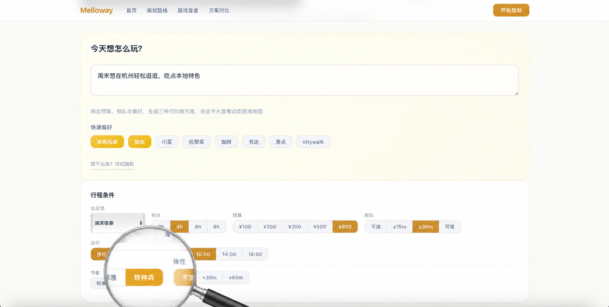
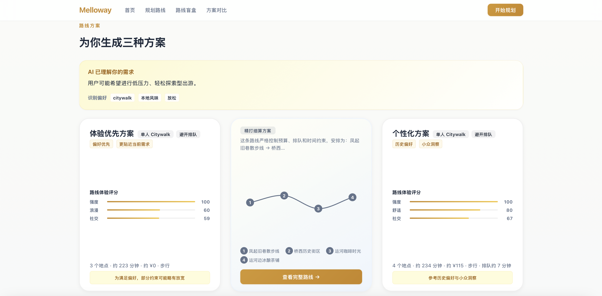
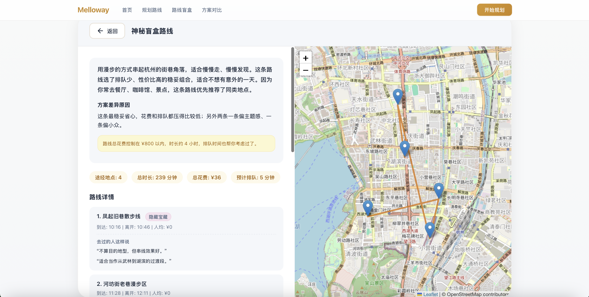

<p align="center">
  <sub>中文 · <a href="#-english">English</a></sub>
</p>

<p align="center">
  <h1 align="center">Melloway</h1>
  <p align="center"><em>少想一点，马上出发</em></p>
</p>

<p align="center">
  <a href="https://ai-local-route-engine.onrender.com"></a>
  
  
  
  
  
</p>

<br>

> Melloway 会根据你的时间、偏好和同行情况生成三条城市路线，也能用盲盒模式带来一点惊喜，用特种兵模式帮你玩得更高效，让每次出门少一点纠结，多一点刚刚好。

<br>

<p align="center">
  
</p>

<br>

## 在线体验

<p align="center">
  <a href="https://ai-local-route-engine.onrender.com"><strong>ai-local-route-engine.onrender.com</strong></a>
 
</p>

<br>

## 产品展示

<p align="center">
  <strong>行程条件</strong><br>
  
</p>

<p align="center">
  <strong>三方案卡片对比</strong><br>
  
</p>

<p align="center">
  <strong>路线详情 + 地图</strong><br>
  
</p>


<br>

## 核心功能

<table>
  <tr>
    <td width="50%">
      <strong>🔀 三方案对比</strong><br>
      <sub>一次生成三条不同策略的路线：体验优先、精打细算、个性化推荐。每条路线附带五维评分（舒适 / 社交 / 浪漫 / 家庭 / 强度），鼠标悬停卡片即翻转查看路线预览。</sub>
    </td>
    <td width="50%">
      <strong>🎁 路线盲盒</strong><br>
      <sub>不想思考时选一个主题（Citywalk / 吃吃喝喝 / 文化之旅 / 小众探索），系统随机生成三条神秘路线。点击卡片展开揭晓，再点折叠收起</sub>
    </td>
  </tr>
  <tr>
    <td width="50%">
      <strong>📍 DIY 必去地点</strong><br>
      <sub>路线生成后添加 1-3 个必去地点，系统据此重新规划路线。已加入的标记确认，暂未纳入的说明原因（预算、距离或排队限制）。</sub>
    </td>
    <td width="50%">
      <strong>⚡ 特种兵模式</strong><br>
      <sub>标准 / 特种兵双节奏切换，弹性加时 0-60 分钟。特种兵模式优先紧凑顺路的 POI，不粗暴压缩所有停留时间。</sub>
    </td>
  </tr>
  <tr>
    <td width="50%">
      <strong>💬 UGC 评论 + 隐藏宝藏</strong><br>
      <sub>每个 POI 展示去过的人的真实评论。小众地点自动标记「隐藏宝藏」标签，让探索多一层惊喜。</sub>
    </td>
    <td width="50%">
      <strong>🗺️ 地图路线可视化</strong><br>
      <sub>Leaflet 交互地图自动展示 POI 标记与路线连线，fitBounds 自动缩放到最佳视野。起点、途经点、终点一目了然。</sub>
    </td>
  </tr>
</table>

<br>

## 为什么不是普通路线规划

大多数地图工具只做一件事：**给你一条从 A 到 B 的最短路径**。

Melloway 做了一个不同的选择：把预算、排队时间、营业时间、口味偏好、同行人身份、游玩节奏**同时放进路线决策里**，然后给出三条策略不同的可比较方案，而不是替用户选一个「最优解」。

**三条方案，三个视角**。用户自己决定今天是精打细算、尽情体验、还是试试不一样的。

<br>

## 本地运行

```bash
git clone https://github.com/violet1668/Melloway.git
cd Melloway
python3 -m venv .venv
source .venv/bin/activate
pip install -r requirements.txt
python3 app.py
# 打开 http://127.0.0.1:5000
```

<br>

## 技术栈

| 层 | 选型 |
|---|---|
| 后端 | Python · Flask |
| 前端 | Vanilla JS · CSS 3D Transform · SVG 动画 |
| 地图 | Leaflet · OpenStreetMap |
| 数据 | 杭州 Mock POI（50+ 地点）· 模拟用户画像 · UGC 评论 |
| 部署 | Render |

<br>

## 项目结构

```
├── app.py                Flask 入口
├── services/             后端服务（11 模块）
│   ├── route_engine.py   三方案路线引擎
│   ├── blindbox.py       盲盒生成
│   ├── pace.py           节奏模式
│   ├── constraints.py    约束过滤
│   ├── scoring.py        POI 评分
│   ├── persona.py        用户画像
│   └── ...
├── data/                 Mock 数据
├── templates/            SPA 页面
├── static/               前端 JS + CSS
├── docs/                 API 契约 · 演示脚本
└── tests/                后端测试
```

<br>

## 团队

| 角色 | 成员 |
|---|---|
| 后端与部署 | Vio |
| 前端与 UI 设计 | Uin |
| 产品设计与用户调研 | 共同完成 |

<br>

## 当前阶段

路线引擎、约束过滤、POI 评分、画像匹配、盲盒、特种兵模式等核心模块已完成并可通过 API 调用。前端三方案卡片、翻转动画、盲盒折叠、DIY 重生成、地图可视化均已在线上运行。

<br>

---

<p align="center">
  <sub>Built with ❤️ for Demo Day · MIT License</sub>
</p>

---

## 🇬🇧 English

Melloway is an AI-powered local route planner. Describe your ideal day out in one sentence — the system generates three comparable route plans with different strategies, each considering your budget, wait tolerance, preferences, and pace. Built with Flask, Vanilla JS, and Leaflet. Currently a demo-stage MVP using Hangzhou mock data.

**Live demo**: [ai-local-route-engine.onrender.com](https://ai-local-route-engine.onrender.com)
